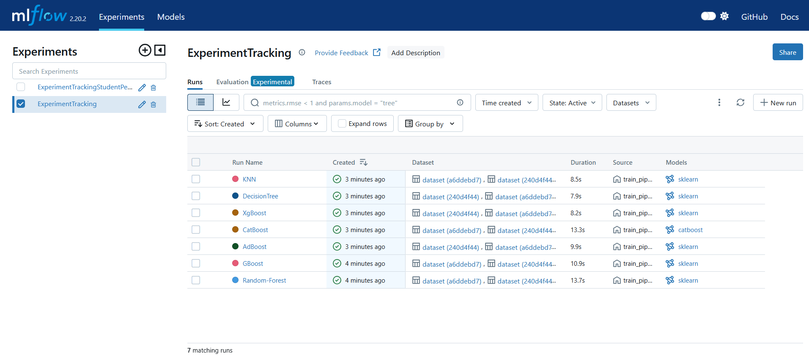
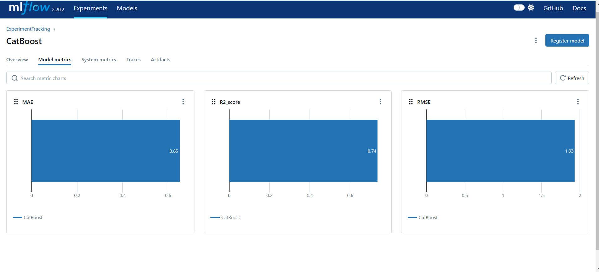

# End-to-End Machine Learning Project with MLOps

## Project Overview

This project demonstrates a complete end-to-end machine learning pipeline with a focus on modularity, maintainability, and scalability. The implementation follows best practices for Machine Learning Operations (MLOps) and includes stages such as data ingestion, transformation, model training, evaluation, and logging. The pipeline is structured to facilitate easy deployment, with upcoming deployment on AWS EC2 for real-time predictions.

## Directory Structure

```
MLOPS/
    ├── artifacts/               # Stores generated datasets, models, and preprocessing pipelines
    ├── catboost_info/           # CatBoost internal information directory
    ├── Logs/                    # Application logs for monitoring and debugging
    ├── mlproject.egg-info/      # Python package metadata
    ├── notebook/                # Jupyter Notebooks for exploratory data analysis
    ├── src/                     # Source code directory
        ├── components/          # Core machine learning components
            ├── data_injestion.py      # Handles data loading and train-test split
            ├── data_transformation.py # Preprocessing and feature transformation logic
            ├── model_trainer.py       # Model training and evaluation logic
        ├── pipeline/            # Training and prediction pipelines
            ├── train_pipeline.py      # Code to execute the training pipeline
            ├── predict_pipeline.py    # Code for inference on new data
            ├── utils.py               # Utility functions like model saving and evaluation
        ├── logger.py            # Logger configuration for the project
        ├── exception.py         # Custom exception handling
    ├── venv/                    # Python virtual environment
    ├── .gitignore               # Git ignore file
    ├── README.md                # Project documentation (this file)
    ├── requirements.txt         # Python dependencies
    └── setup.py                 # Python package configuration
```

## Installation

To set up the project, follow these steps:

```bash
# Clone the repository
$ git clone <repository_url>

# Navigate to the project directory
$ cd MLOPS

# Create and activate a virtual environment
$ python -m venv venv
$ source venv/bin/activate  # For Linux/Mac
$ .\venv\Scripts\activate  # For Windows

# Install the required dependencies
$ pip install -r requirements.txt
```

> **Note:** The `-e .` line in `requirements.txt` is specific to building the package and should be removed when installing dependencies.

## Running the Training Pipeline

To execute the end-to-end training pipeline:

```bash
$ python src/pipeline/train_pipeline.py
```

This command triggers the pipeline to perform data ingestion, data transformation, model training, and evaluation.

## Key Components

### 1. **Data Ingestion (**``**):**

- Loads the dataset from the specified location.
- Splits the dataset into training and testing sets (80/20 split).
- Stores the datasets in the `artifacts` directory.

### 2. **Data Transformation (**``**):**

- Identifies numerical and categorical features.
- Applies imputation, scaling, and one-hot encoding using `Pipeline` and `ColumnTransformer`.
- Saves the preprocessor pipeline as `preprocessed_pipeline.pkl`.

### 3. **Model Trainer (**``**):**

- Trains multiple models including Random Forest, Gradient Boosting, CatBoost, and XGBoost.
- Evaluates model performance using R² score and RMSE.
- Selects the best-performing model and saves it as `model.pkl`.

### 4. **Pipeline Execution:**

- `train_pipeline.py` orchestrates the entire process.
- Future development: `predict_pipeline.py` will be used for inference.

### 5. **Logger (**``**):**

- Logs key activities like data loading, transformation, training, and exceptions.
- Logs are stored in the `Logs` directory.

### 6. **Exception Handling (**``**):**

- Provides custom error messages with file name and line number for easier debugging.

### 7. **Utilities (**``**):**

- Contains reusable functions such as model saving and performance evaluation.

### 8. **Experiment Tracking with MLflow:**

- `MLflow` is integrated to track experiments, model parameters, metrics, and artifacts.
- Allows for better monitoring, comparison, and reproducibility of experiments.


## Model Performance

The model with the best performance is `CatBoostRegressor` with:

- **MAE:** 0.6032185920818891
- **R2_score:** 0.7566445483011821
- **RMSE:** 1.8546824381753373

- **Hyper-tuned Model Results**


- **Logging Datasets and Params of the model**


- **Logging the Source-code and Model**


- **Logging Metrics**



## Next Steps

- **Hyperparameter Tuning:** To optimize model performance.
- **Model Deployment:** Deploy the trained model to AWS EC2 for real-time predictions.

## Deployment Plan

- Prepare `predict_pipeline.py` for inference.
- Create an AWS EC2 instance.
- Set up the server environment and deploy the model.
- Implement APIs to enable external access to predictions.

## Author

- **Name:** Suhaib Mukhtar
- **Email:** [suhaibmukhtar2@gmail.com](mailto\:suhaibmukhtar2@gmail.com)


